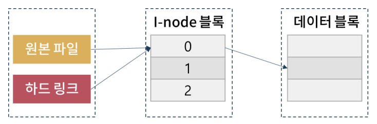
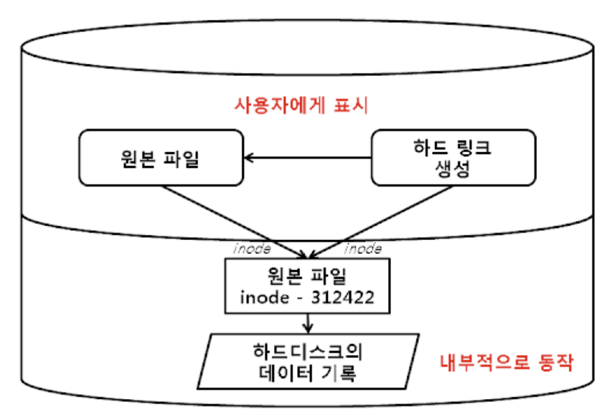
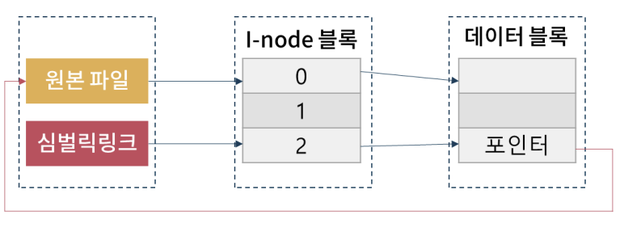
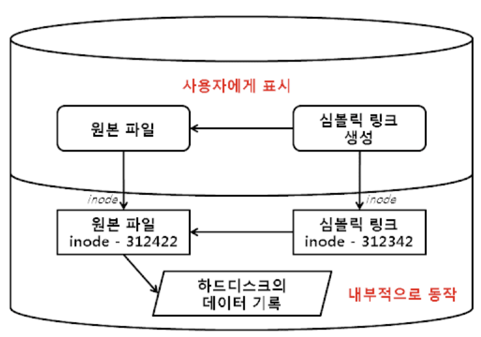
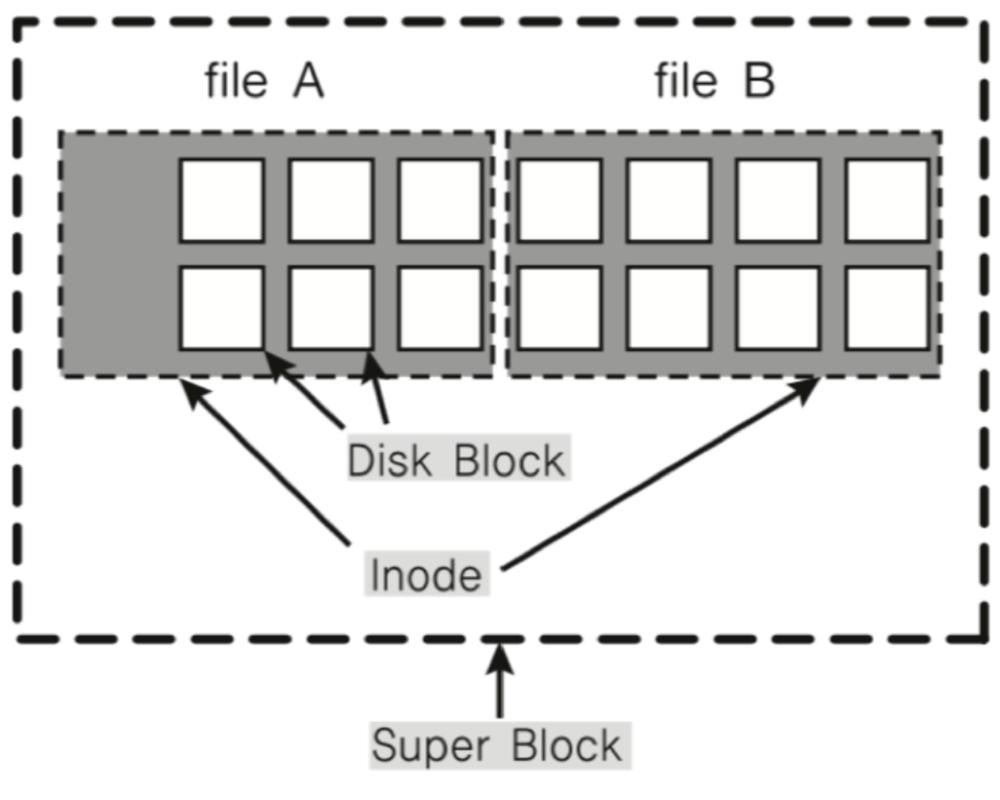
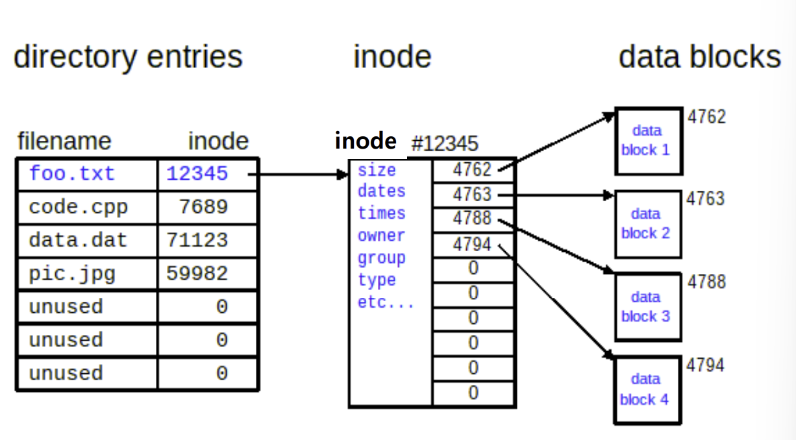
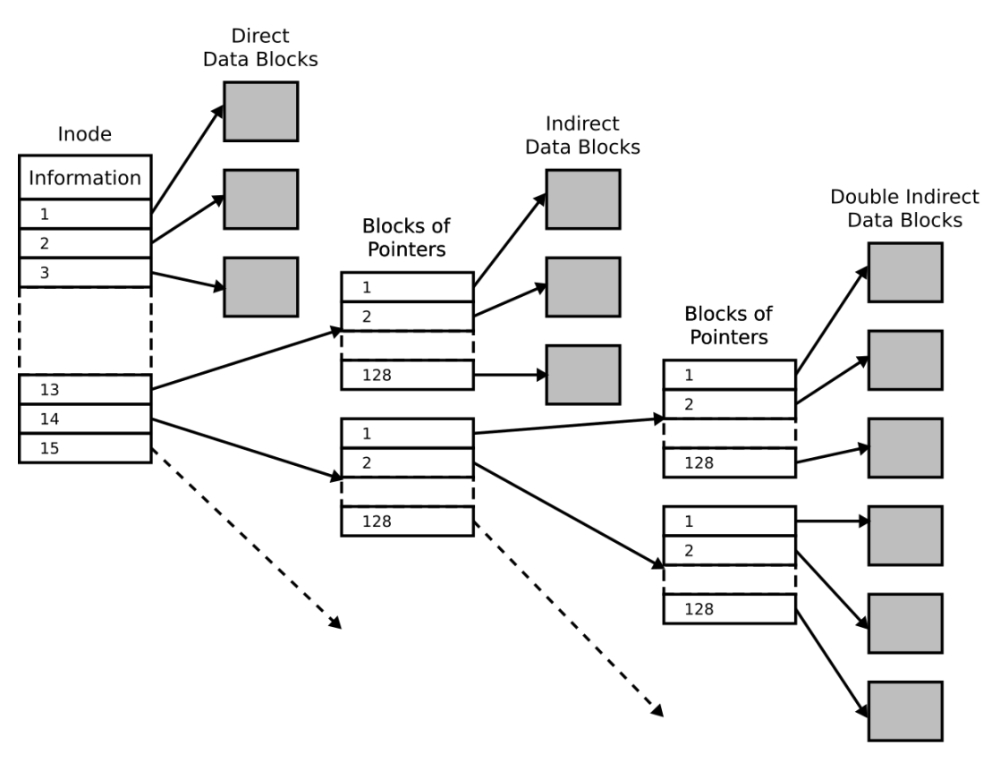

# 리눅스
## 리눅스 파일
- `File` : 데이터를 저장하고 조직하는 기본적 단위
    1. `Directory`
        - 하나의 파일로서 상위 디렉토리 파일에 등록
        - 타 파일 목록(해당 파일들의 주소를 가리키는 포인터 포함) 보유
        - `디렉토리 계층`
            - ```~$ tree / -L 1```
            - 최상위 파일(루트 디렉토리)
                - ```/(root)```
            - 상위 디렉토리 : `..`
            - `working directory` : `.`
            - `home directory` : `~`
            - 경로
                1. 절대 경로 : 항상 `/(root)`부터 시작
                1. 상대 경로 : 현재 디렉토리 기준으로 시작하며 '/'가 먼저 쓰이지 않음
    1. `Regular File`
        - 텍스트, 문서, 이미지, 동영상, 실행파일 등 스트림 파일
    1. `Special File`
        1. `Device File`
            1. `block`형 : 저장 장치 파일
                - CD/DVD, 하드 디스크 등
            1. `character`형 : 문자 기반 파일
                - 터미널, 키보드 등
        1. `Pipe`
            - 특정 프로그램의 출력을 다른 파일의 입력으로 보냄
        1. `Socket`
            - 네트워크의 입출력 담당하는 API


## File
- `Link File`
    1. `Hard Link File`
        - **공유개념**
        - 원본 파일의 inode에 대한 직접적인 포인터
        - 새로운 inode 생성 없음
        - 원본 파일 삭제할 경우 **액세스 가능**
        - 원본 파일은 하드 링크와 차이 없음
        - 하드 링크 만드는 명령어
            ```$ ln [원본 파일] [링크 파일]```
    
    1. `Symbolic Link File`
        - **바로가기 개념**
        - 원본 파일의 inode를 가리키는 정보가 있는 파일
        - 새로운 inode 생성
        - 원본 파일 삭제할 경우 **액세스 불가**
        - 심볼릭 링크 만드는 명령어
            - ```$ ln –s [원본 파일] [링크 파일]```
    

## 파일 시스템
- `UFS`(Unix File System) : 디렉토리 구조로 파일 조직하며, 텍스트 문서, 실행파일, 디렉토리 자체도 모두 파일로 취급함
    
    1. `Super Block` : 파일 시스템을 대표
    1. `I-node Block` : 파일의 상세 정보, 일종의 **PCB**
    1. `Data Block` : 실제 데이터를 담음
        - 실제 데이터가 저장된 블록
        - 직접 접근 데이터 블록
        - 간접 접근 데이터 블록
        
        
        [리눅스 파일 구조](https://distributedsystemsblog.com/posts/linux-file-search/)

## i-node
- `i-node`(index-node) : 파일 시스템 개체를 표현하는 구조체
    - 모든 파일이나 디렉토리는 반드시 하나의 inode 가짐
    - `메타 데이터`(접근 권한, 소유주, 크기, inode 번호 등)
        1. 파일명 : 사용자가 파일 접근시 사용하는 식별자
            - 실제 컴퓨터는 `파일이름:inode`로 **파일**과 **inode 번호** 매칭하여 인식
        1. `Block Pointer` : 블록의 주소를 가리킴
            - `Block` : 하나의 데이터 모음 덩어리

        