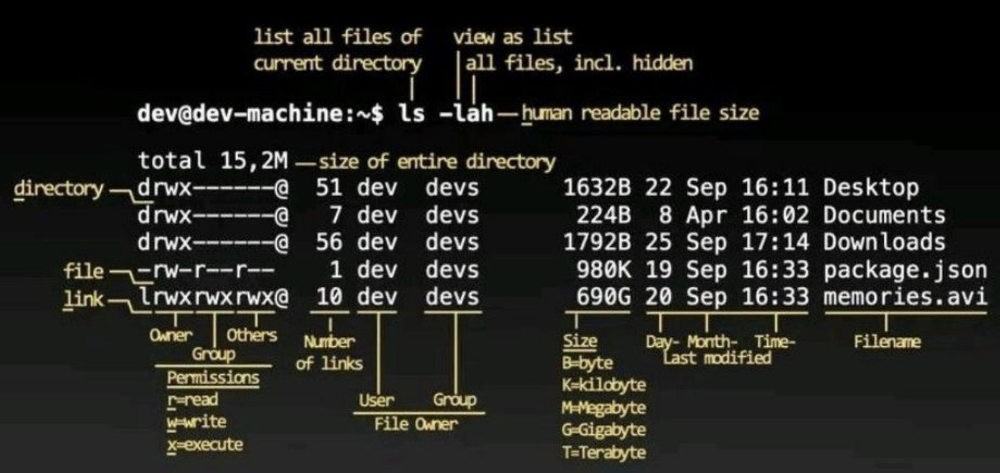

# Linux Instruction
## 명령어 구조
- 형식 : 명령 [옵션] [인자 ......]

## 기초 명령어
- `date`
    ```ruby
    # 날짜와 시간 출력
    $ date
    Wed 09 Sep 2022 11:29:14 AM KST
    ```
- `clear`
    ```ruby
    # 화면 지움
    $ clear

    ```
- `man`
    ```ruby
    # 명령어의 사용법 출력
    $ man clear
    clear(1) General Commands Manual
    Name 
            celar -clear the terminal screen
            ...
            ...
    ```
- `passwd`
    ```ruby
    # 사용자 계정의 패스워드 변경 
    $ passwd
    Changing password for opensw.
    Current password: 
    New password: 
    Retype new password: 
    passwd: password updated successfully
    ```
- `exit`
    ```ruby
    # [방법1] 터미널 종료
    $ exit
    ```
    ```ruby
    # [방법2] Ctrl  + D
    $ ^d
    ```


## 디렉토리 명령어
- `pwd` : print working directory
    ```ruby
    # 현위치의 절대 경로 출력
    $ pwd
    /home/user
    ```
- `cd` : change directory  
    ```ruby
    # 지정 디렉토리로 이동
    $ cd /etc
    $ pwd
    /etc
    ```  
    ```ruby
    ## cd만 입력할 경우, 홈 디렉토리로 이동
    $ cd
    $ pwd
    /home/user
    ```
- `ls` : list
    ```ruby
    # 디렉토리 내용 출력
    $ ls
    Desktop  Documents  Downloads
    ```
    ```ruby
    ## ls 뒤에 경로 지정할시, 이동없이 해당 경로의 디렉토리 내용 출력 가능
    $ ls /etc
    ```
    - 옵션
        - `-a`(all) : 숨김 파일 포함한 모든 파일
        - `-l`(long format) : 상세정보
        - `-i`(inode) : 각 파일과 디렉토리의 아이노드 출력
        - `-d`(directory) : 디렉토리 자체 정보
        - `-R`(Recursive) : 주어진 디렉토리 및 하위 디렉토리에 있는 파일을 재귀적으로 나열
        - `-F` 또는 `--classify` : 파일 타입
            1. 특수문자X : 파일 
            1. `*` : 실행파일
            1. `/` : 디렉토리
            1. `@` : 심벌릭 링크
            1. `=` : 소켓 파일
            1. `|` : FIFO(명명된 파이프)
        - `-h`(human readable file size)
            
            
- `mkdir` : make directory
    ```ruby
    # 디렉토리 생성
    ## 이름을 공백 문자로 구분하여 복수의 디렉토리 생성 가능
    $ ls
    Desktop    Downloads  Music
    $ mkdir -p ex1/ex1-1 ex1/ex1-2
    $ ls
    Desktop  Downloads  Music  ex1
    $ ls ./ex1
    ex1-1 ex1-2
    ```
    - 옵션
        - `-p`(parent) : 하위 디렉토리의 중간 디렉토리없을 경우, 자동으로 중간 디렉토리 생성
                
- `rmdir` : remove directory
    ```ruby
    #지정 디렉토리 삭제
    ## 지정한 디렉토리 : ex3
    ## 상위 디렉토리 : ex2
    $ mkdir -p ./ex1/ex2/ex3
    $ ls -R ./ex1
    ./ex1:
    ex2

    ./ex1/ex2:
    ex3

    ./ex1/ex2/ex3:
    $ cd ex1
    $ rmdir -p ex2/ex3
    $ ls

    ```
    - 
    - 옵션
        - `-p`(parent) : 지정한 디렉토리 삭제 & 상위 디렉토리 빈 경우 상위 디렉토리도 삭제
                

## 파일 사용 명령어
- `cat` : concatenate
    ```ruby
    # 파일 내용 출력
    $ cat /etc/hosts
    130.0.0.1       localhost
    130.0.1.1       user
    .
    .
    .
    ```
    - 옵션
        - `-n`(number) : 행 번호 출력


- `more`
    - 파일 내용을 화면 단위로 표시
    - 옵션
        - `+ 행번호` : 해당 행부터 출력 시작
            ```ruby
            $ more /etc/services +6
            ```
    - more 명령에서 사용하는 키
        - `[Space Bar]키` : 다음 화면 출력
        - `[Enter]키` : 한 줄씩 스크롤
        - `/ + [문자열]` : "문자열"을 찾아 이동 
        - `q` : 종료

- `less` : oppsite of more
    - 파일 내용을 화면 단위로 출력
    - less 명령에서 사용하는 키
        - `[Space Bar]키` : 다음 화면 출력
        - `j` : 한 줄씩 다음 행으로 스크롤
        - `k` : 한 줄씩 이전 행으로 스크롤
        - `Ctrl + f` : 다음 화면으로 이동
        - `Ctrl + b` : 이전 화면으로 이동

- `tail` : last part of files
    - 파일 뒷부분 몇 행 출력
    - 옵션
        - `+ 행번호` : 해당 행 번호부터 끝까지 출력
        - `- 숫자` : 화면에 출력할 행의 수 지정
        - `-f` : 파일 출력 종료하지 않고 주기적으로 계속 출력

- `cp` : copy
    - ```cp [옵션] [원본 파일명/디렉터리] [목적지 파일명/디렉터리]```
    ```ruby
    # 파일 또는 디렉터리를 복사 또는 덮어 씀
    $ ls
    Desktop  Documents  Downloads
    $ cp /etc/hosts .
    $ ls
    Desktop  Documents  Downloads  hosts
    ```
    - 옵션
        - `-i` : 목적지 파일명이 존재하면 덮어쓸 것인지 확인
        - `-r` : 디렉터리 복사시 사용
        - `-p`(preserve) : 원본 파일의 소유자, 그룹, 권한 등의 정보까지 복사
    
- `mv` : move
    - 파일 이동 또는 파일 덮어씀
    - ```mv [옵션] [원본 파일명/디렉터리] [목적지 파일명/디렉터리]```
    - 옵션
        - `-i` : 목적지 파일명이 존재하면 덮어쓸 것인지 확인    

- `rm` : remove
    - 파일 지움(옵션에 따라 디렉토리도 지움)
        - 옵션
            - `-f`(force) : 쓰기 권한없는 파일 포함하여 아무 메시지 없이 지움
            - `-i`(interactive) : 파일마다 지울 것인지 확인
            - `-r`(recursive) : 디렉토리명 지정해주어 해당 디렉토리 내 모든 내용 지움
                - **해당 옵션이 없을 경우 디렉토리 지우지 못함**

- `ln` : link
    - ```ln [옵션] [원본 파일명] [대상 파일명]```
    - 옵션
        1. 옵션 없음 : hardlink
            ```ruby
            $ cp /etc/hosts .
            $ ls
            Desktop  Downloads  Music  hosts
            # 하드 링크 파일 생성
            $ ln hosts hardlink
            # 하드링크의 갯수 확인하는 명령어
            $ ls l
            total 40
            ## 숫자 2는 하드링크의 수를 의미(1보다 큰 경우 하드링크를 가진다는 의미)
            -rw-r--r-- 2 opensw opensw 218 Sep 9 13:23 hardlink 
            -rw-r--r-- 2 opensw opensw 218 Sep 9 13:23 hosts
            # 아이노드 확인하는 명령어
            ## hardlink(176146)와 hosts(176146)의 아이노드 같음
            $ ls -i 
            180925 Desktop     176146 hardlink    176146 hosts
            180926 Downloads   180930 Music
            ```
        2. `-s` : symbolic
            ```ruby
            # 심볼릭 링크 파일 생성
            $ ln -s hosts softlink
            # 하드링크 갯수 확인하는 명령어
            ## softlink는 하드링크 갯수에 포함X
            $ ls -l
            -rw-r--r-- 2 opensw opensw 218 Sep 9 13:23 hardlink
            -rw-r--r-- 2 opensw opensw 218 Sep 9 13:23 hosts
            lrwxrwxrwx 1 opensw opensw 5 Sep 9 13:23 softlink -> hosts
            # 아이노드 확인하는 명령어
            ## softlink(180864)와 hosts(176146)의 아이드 다름
            $ ls -i
            180925 Desktop    176146 hardlink    176146 hosts
            180926 Downloads  180930 Music       180864 softlink
            ```
- `touch`
    - ```touch [옵션] [생성할 파일]```
    ```ruby
    # 빈 파일 생성 및 파일의 타임스탬프 변경
    $ touch ex1
    $ ls -l ex
    ## 빈 파일이기 때문에 용량이 0
    -rw-rw-r-- 1 opensw opensw 0 Sep 9 13:37 ex
    ```
    - 옵션
        - `-c`(no-clobber) : 현재시간으로 타임스탬프 업데이트
        - `-t + [YYYYMMDDhhmm]`(timestamp) : 원하는 시간으로 타임스탬프 업데이트

- `grep` : global regular expression print
    - ```grep [옵션] [검색할 문자] [파일명]```
    ```ruby
    # 주어진 텍스트에서 특정 패턴이 포함된 행 출력
    $ grep localhost /etc/hosts
    127.0.0.1     localhost
    ::1 ip6-localhost ip6-loopback
    ```
    - 옵션
        - `i`(ignore-case) : 대소문자 구분 없이 검색
        - `v`(invert-match) : 검색할 문자가 존재하지 않는 행만 출력
        - `n`(number) : 행 번호 출력

- `find`
    - ```find [directory-path] [option]```
    ```ruby
    # 조건에 맞는 파일 검색
    $ find /usr/bin -name grep
    /usr/bin/grep
    $ fincd . -mtime 6
    $ find . -user Downloads
    $ find . -perm 777
    $ find . -type d
    ```
    ```ruby
    # 옵션 -exec 사용
    $ find expr/ -type f -exec cat {} \;

    $ find temp/ -name *.txt -exec ls -al () \;
    ```
    - 옵션
        - `-name + [파일명]` : 해당 파일명으로 검색
        - `-mtime + n` : 최근 n * 24시간 동안 변경 이력 있는 파일 검색
        - `-user + [유저명]` : 지정한 유저명이 보유하고 있는 파일 검색
        - `-perm + [액세스 권한]` : 지정한 액세스 권한과 동일한 파일 검색
        - `-type + [파일 유형]` : 지정한 파일 유형의 파일 검색
            - `f`(file) : 일반파일
            - `d`(directory)
            - `l`(symbolic link)
            - `b`(block device file)
            - `c`(character device file)
            - `p`(pipe)
        - `-exec + [명령어] {} \;`(execute) : 검색된 파일에 지정한 명령 실행