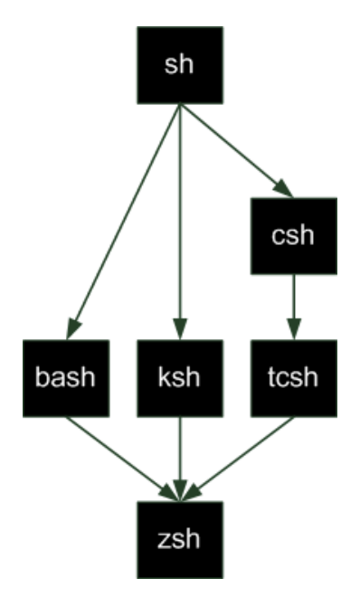

## 리눅스의 구조
1. hardware
1. `Kernel`
    - 하드웨어 제어 코드를 통해 시스템의 모든 자원을 통제/관리

1. `Shell`
    - 명령어 해석기
    - 사용자가 입력한 명령어를 커널에 전달하는 역할

1. `Application`
    - 각종 문서 편집 프로그램, 웹 브로우저 등
- [참고](https://www.naukri.com/learning/articles/unix-vs-linux/)
    

## Shell
- 쉘의 기능
    1. 명령어 해석기 기능
        - 사용자와 커널 사이에서 명령 해석

    1. 프로그래밍 기능
        - `Shell Programming` : 프로그래밍 기능을 이용하여 반복적으로 수행하는 작업을 하나의 프로그램으로 제작 $\Rightarrow$ `Shell Script`(프로그램)

    1. 사용자 환경 설정 기능
        - Bash 쉘 환경 설정 파일
            - 사용자가 로그인 $\rightarrow$ `초기화 파일` 실행 $\rightarrow$ 사용자의 `초기 환경 설정`
            1. `.bashrc`
                - `interactive shell`에서 실행
                - 사용자가 쉘 프롬프트에 명령 입력하고 상호작용할 시 사용
            1. `.bash_profile`
                - `login shell`에서 실행
                - 사용자가 로그인시 실행되는 쉘
                - 일반적으로 .bashrc를 호출하여 중복을 피하기 위해 사용
                    ```bash
                    if [ -f ~/.bashrc ]; then
                        source ~/.bashrc
                    fi
                    ```
- login shell vs sub shell

    1. login shell
        - 사용자가 로그인하면 자동으로 생성되는 기본적인 쉘
    1. sub shell
        - 로그인 쉘에서 실행시킨 다른 쉘
- 쉘 종류
    - [참고](https://www.pdfprof.com/PDF_Image.php?idt=100983&t=40)
    
    - [참고](https://levelup.gitconnected.com/what-happens-where-you-type-ls-l-in-a-linux-shell-98ad95430cbf)

    - Bourne Shell
        - 유닉스 V7에 처음 등장한 최초의 쉘
        - `sh` : 본 쉘 실행 명령어
        - 초기에 단순하고 처리 속도가 빨라 많이 사용
        - 히스토리, 에일리어스, 작업 제어 등 기능 제공X
    - C Shell
        - `csh` : C 쉘 실행 명령어
        - 사용자 편의 기능(히스토리 등) 제공
    - Korn Shell
        - 본 쉘과의 호환성 유지(C Shell과 달리)
        - C Shell의 특징(사용자 편의 기능)도 제공
        - `ksh` : 콘 쉘 실행 명령어
    - Bash Shell
        - 본 쉘과의 호환성 유지(C Shell과 달리)
        - C 쉘과 콘 쉘의 편리 기능 포함
        - GPL 라이선스에 의거하여 자유롭게 사용 가능
        - `bash` : 배시 쉘 실행 명령어
    - Dash Shell
        - 본 쉘 기반으로 **작은 크기**로 개발

- 기본 명령어
    - `chsh` : change login shell
        - `chsh [옵션] [사용자명]`
            - 옵션
                - `-s + [쉘의 절대 경로]` : 지정하는 쉘을 앞으로 사용할 로그인 쉘로 변경
        1. 사용자의 로그인 쉘 변경
            ```ruby
            $ chsh -s /bin/sh opensw
            Password:
            # 쉘 변경 확인
            $ grep opensw /etc/passwd
            opensw:x:1000:1000:OpenSW,,,:/home/opensw:/bin/sh
            $ 
            ```
        1. 배시 쉘로 변경
            ```ruby
            $ chsh -s /bin/bash opensw
            Password: 
            $ grep opensw /etc/passwd
            opensw:x:1000:1000:OpenSW,,,:/home/opensw:/bin/bash
            $ 
            ```
    - `echo` : echoes
        - 화면에 한 줄의 텍스트 출력
        - `echo [옵션] 문자열`
            - 옵션
                - `-n` : 마지막에 줄 바꿈X
        ```ruby
        $ echo hello
        hello
        $ echo -n hello
        hello~$
        ```
- 쉘 특수 문자
    - `*`
        - 임의의 문자열을 나타내는 특수 문자
        - 0개 이상의 문자로 대체
        - 파일명이 들어가야 하는 부분에 *을 단독으로 사용 $\rightarrow$ 모든 파일 표시
        ```ruby
        $ ls h*
        hardlink hello hosts
        ```
    - `?`와 `[]`
        - **한 문자**를 나타낼 경우 사용
        - `?` : 길이가 1인 임의 한 문자 의미
            ```ruby
            $ ls -F host?
            hosts
            ```
        - `[]` : 괄호 안에 포함된 문자를 나타냄
            - [0-9]와 같은 **범위 지정 가능**
            ```ruby
            $ ls -F [a-z]*
            ```
    - `~`와 `-`
        - `~` : 홈 디렉토리
        - `-` : 이전 작업 디렉토리 
            ```ruby
            $ cd /etc/
            # 홈 디렉토리로 이동
            /etc$ cd ~
            # 이전 작업 디렉토리로 이동
            ~$ cd -
            /etc$
            ```
    - `|`와 `;` 
        - `|` : pipe
            - 왼쪽 명령의 실행 결과를 오른쪽 명령의 입력으로 전달
            ```ruby
            ## 파일.txt에서 [키워드]를 검색한 결과를 정렬하여 출력
            $ grep [키워드] 파일.txt | sort
            $ ls -al /dev/ | less
            ```
            ```ruby
            $ cat /etc/hosts | grep local
            127.0.0.1 localhost
            ::1 ip6-localhost ip6-loopback
            fe00::0 ip6-localnet
            $
            ```
        - `;`
            - 연결된 명령을 왼쪽부터 차례로 실행
            ```ruby
            $ ls ; cd/etc
            Desktop  Documents  Downloads
            /etc$ 
            ```
    - `''`와 `""`
        - `''` : 문자를 감싼 문자열로 만들고 **모든 특수문자의 기능 제거**
        - `""` : 작은 따옴표의 기능과 동일하나 **`$`, ` `` `, `\`를 제외**한 모든 특수 문자의 기능 제거
        ```ruby
        # '' 사용하여 특수문자 기능 제거
        $ echo '$SHELL'
        $SHELL
        # "" 사용하여 $와 같은 특수문자 기능 제거X
        ## $SHELL : 환경변수, 현재 사용 중인 쉘 경로 나타냄
        $ echo "$SHELL"
        /bin/bash
        ```
    - ` `` `
        - ``에 감싸진 문자열을 명령으로 해석
        - 주로 명령 내에서 명령 줄 때 사용
        ```ruby
        $ echo "Today is `date`"
        Today is Mon Oct 3 04:31:23 PM KST 2022
        ```
    - `\`
        - 특수문자 앞에 있으면 일반 문자처럼 취급
        ```ruby
        $ echo \$SHELL
        $SHELL
        $
        ```
    - 기타
        |특수문자|형식|의미|
        |:-:|:-:|:-:|
        |>|명령 > 파일명|명령 수행 결과를 파일에 저장(`출력 리다이렉션`)|
        |>>|명령 >> 파일명|>과 다르게 명령 수행 결과를 파일에 추가|
        |<|명령 < 파일명|파일로부터 입력 값을 받음(`입력 리다이렉션`)|  
        ```ruby
        # 표준 출력을 파일로 리다이렉션하는 연산자
        $ mkdir expr
        $ cat /etc/hosts > expr/cphosts.txt
        ```
        ```ruby
        $ echo $SHELL
        /bin/bash
        # 출력 리다이렉션
        $ echo $SHELL > myshell
        $ cat myshell
        /bin/bash
        # 해당 문자열을 파일에 추가
        $ echo "Appendix" >> myshell
        $ cat myshell
        /bin/bash
        Appendix
        # 입력 리다이렉션
        $ cat < myshell
        /bin/bash
        Appendix
        ```
## 환경 변수
    - Variable : 시스템이나 사용자에 의해 사용되는 정보를 저장하기 위한 저장소
    - Shell Variable : **현재의 쉘**에서만 확인 가능한 변수
        - `set` : 확인 명령
        - `변수명=값` : 쉘 변수 설정 명령어
            - 단, 변수명과 값 사이에 공백 X
        ```ruby
        # 쉘 변수
        $ CBNU=SOFTWARE
        $ echo $CBNU
        SOFTWARE
        $ set | grep CBNU
        CBNU=SOFTWARE
        ```
    - Environment Variable : **모든 쉘**에서 공통으로 사용하는 변수
        - `env` : 확인 명령    
        - 환경 변수 설정 단계
            1. 먼저 쉘 변수 정의
            1. export 명령어로 export 변수명 형태로 명령 $\Rightarrow$ 환경변수로 변경 
        - 
        ```ruby
        # 환경 변수
        ## 환경변수 설정 전 쉘 변수 정의
        $ CBNU=SOFTWARE
        ## CBNU가 아직 환경변수로 등록되기 전이라 결과가 비어있음
        $ export | grep CBNU
        ## 환경변수로 설정
        $ export CBNU
        $ export | grep CBNU
        declare -x CBNU="SOFTWARE"
        # 환경변수 확인
        $ env
        SHELL=/bin/bash
        LC_ADDRESS=en_US.UTF-8
        LC_NAME=en_US.UTF-8
        ```
    - 변수 해제
        ```ruby
        $ unset CBNU
        $ export | grep CBNU
        $
        ```
    - 주요 환경 변수
        |환경변수|의미|환경변수|의미|
        |:-:|:-:|:-:|:-:|
        |HISTSIZE|히스토리 저장 크기|PATH|명령을 탐색할 경로|
        |HOME|사용자 홈 디렉토리의 절대경로|PWD|작업 디렉토리 절대경로|
        |LANG|사용하는 언어|SHELL|로그인 쉘|
        |LONGNAME|사용자 계정이름|||
        ```ruby
        $ echo $HISTSIZE
        1000
        $ echo $HOME
        ```

## 설정 파일
- 환경 설정 파일
    - 사용자가 로그인할 때마다 자동 실행되는 명령을 저장한 파일
    - 보통 홈 디렉토리 안에 위치
        - `.`으로 시작하는 파일들이 해당
    - 종류
        1. 시스템 환경 설정 파일
            |파일|수행되는 경우|설명|
            |:-:|:-:|:-:|
            |/etc/profile|사용자 로그인시|시스템 전체의 공통된 초기화 설정을 위한 파일이며 모든 사용자에게 적용|
            |/etc/bash_bashrc|쉘이 실행시|리눅스 부팅 시 설정해둔 함수나 alias 환경 변수를 적용하는 파일|
            |/etc/profile.d*.sh|필요시|설정 파일을 추가할 때 사용|
        1. 사용자 환경 설정 파일
            |파일|설명|
            |:-:|:-:|
            |~/.profile|로그인 시, 경로 추가와 같은 사용자 정의 환경 설정|
            |~/.bashrc|쉘 실행 시, 기본 alias, 함수 등 설정|
            |~/.bash_logout||로그아웃 시, 실행할 필요가 있는 함수 등 설정|


## Alias
- 기존 명령에 별명을 붙여 사용할 수 있는 기능
    - 긴 명령 또는 사용도가 빈번한 명령어를 짧게 지정하여 사용
- `alias` : 현재 설정된 alias list 출력
- alias 생성 명령어
    - `alias 이름='명령'` : 생성    
    - `alias 이름='명령1';'명령2'` : 2개 이상 명령을 하나의 이름으로 사용할 경우
        ```ruby
        $ alias rm='rm -i'
        $ touch ex
        $ rm ex
        rm: remove regular empty file 'ex'? y
        $
        ```
- alias 해제 명령어
    - `unalias`
    ```ruby
    $ alias rm='rm -i'
    $ unalias rm
    $ touch ex
    $ rm ex
    $
    ```

## History
- 명령 입력 기록 출력
- 사용법 : `history`
    ```ruby
    $ history
        ...
        467 clear
        468 history
    $
    ```
- 명령 재실행
    |형식|기능|
    |:-:|:-:|
    |!!|바로 직전에 실행한 명령 재실행|
    |! + [번호]|히스토리에 해당 번호의 명령 재실행|
    |! + [문자열]|히스토리에서 해당 문자열로 시작하는 마지막 명령 실행|
    ```ruby
    $ ls
    Desktop   Downloads   Music  Public 
    $ !!
    ls
    Desktop   Downloads   Music  Public 
    $ history
        ...
        470 history
        471 clear
        472 ls
        473 history
    $ !472
    ls
    Desktop   Downloads   Music  Public 
    $ !l
    ls
    Desktop   Downloads   Music  Public 
    ```


## /etc에서는 왜 파일을 생성하지 못하는가?
- 너는 root 권한이 아니기 때문에

## 파일 또는 디렉토리의 권한 제어
- 쓰기 권한을 없애고 파이프라인으로 파일에 텍스트 추가 해봐라
